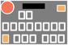

# psd-in-md

Helps keep Markdown editing fun.

Automates maintenance of Markdown files. Generates and inserts images into a specially formatted Markdown.

## Usage

> `usage: psd-in-md [-h] [--button-pattern-file BUTTON_PATTERN_FILE] [--psd-file PSD_FILE] [--psd-out-dir PSD_OUT_DIR] [--image-height IMAGE_HEIGHT] [--print-formatted] [--print-extract] md_file`

More documentation is available with `psd-in-md -h`.

## Origin

To help keep Markdown editing fun, this tool aims to alleviate some of the cost of creating standardized but customized images used in technical manuals.

Specifically this is designed for the needs of the Qun mk2 synthesizer project's [README.md](https://github.com/raspy135/Qun-mk2) guide. Images are helpful visualizations to teach synthesizer control combinations which users memorize in order to activate features on the synthesizer. 

Updating the images and the Markdown is work which is worthy of automation.

# Features

* Extract sequences of names of button controls from formatted Markdown tables
* Generate images by compositing a set of layers of a diagram based upon the button control sequence's names 
* Update the original Markdown with generated images
* Customize: button patterns

**Before**

|              Button               | Description |
|:---------------------------------:|-------------|
| SHIFT + SEQ PLAY + turn dial <br> | Do thing    |

**After**

|                           Button                           | Description |
|:----------------------------------------------------------:|-------------|
| SHIFT + SEQ PLAY + turn dial <br>  | Do thing    |

# Instructions and specifications

**Workflow**

1. Add table with `"Button"` header text in first column of a Markdown
2. Add button command sequence text to a cell in that column
3. Add a `<br>` tag at end of that text
4. Run the tool

## Details

* Tables **MUST** have a first column header name of "`Button`". Non-matching tables will be ignored.
* Each first-column cell's contents **MUST** be formatted according to the following. Non-matching cells will be ignored. `Button sequence string` `<br>` `` - see an [example](#Example) below.
  * Note that the `<br>` tag is required. 
  * Note also that the image link is optional. It will be added automatically when there is a properly formatted button sequence and `<br>` tag.
* Group names of controls in a **button sequence string**, a formatted sequence. E.g. "SHIFT + B1".
  * Internally, the **button sequence string** is parsed to individual button names, e.g. "SHIFT" and "B1"
  * The individual button names are used to extract layers. Then a final image is composited from those layers.
* Button names may differ from the names used for the diagram layers. A mapping between the user-facing formatted sequence naming and the layers is implemented.
* Images are sized down to fit in tables. Use the `--image-height` parameter to customize the height.
* PSD file must have a layer titled, `"BG"`. This will be composited behind all other layers during image generation.
* PSD file layer names must include short-names. These short-names must be located after a hyphen (-) in the layer name.
  * E.g. the `"s"` in the layer name, `"SHIFT - s"`
  * See also the [image name discussion](#generated-image-names).

## Generated image names

Images are named according to their button sequence, with shortened button names.

* Names are shortened
  * E.g. "SHIFT" becomes "s", "B1" and "B2" become just `"1"` and `"2"`
* Sequence of names are concatenated together, with underscores separating the buttons that aren't the number-buttons
  * E.g. "SHIFT+B1+B2" becomes filename `"s_12.png"`

## Button pattern file

Button pattern files are used to define the matching pattern and the corresponding button's shortened name. 

The files are formatted:

* having keys and values separated by an equals (=)
  * `[B]?1 = 1`
* using regular expressions for the keys
  * `^[B]?1$` matches "B1" and "1"
* supporting optional hash-tag (#) comment lines
  * `# this is a comment`

A [default button pattern file](qunmk2_button_patterns.txt) is provided for the Qun mk2 synthesizer.

# Examples

Markdown showing a supported table and cells. Illustrates:

1. Supported cell pattern, already populated with an image path. Image will be generated.
2. Supported cell pattern, and needing an image. Image will be generated, and cell contents will be updated with image link after br-tag. 
3. Cell pattern not supported. Has no br-tag. No image will be generated, and no cell modifications will be made. 

```markdown
|               Button               | Description                            |
|:----------------------------------:|----------------------------------------|
| B1 + B2 <br>  | A button sequence and image            |
|          SHIFT + B3 <br>           | No image. Will be injected with image. |
|             SYS + B4               | No br-tag. Won't receive image.        |
```


Commandline run, showing options, verbosely:

* `python3 __main__.py` and `python3 __main__.py -h`

Formats Markdown file, generates image to the `out` directory:

* `python3 __main__.py test.md --psd-out-dir out --psd-file test.psd`

Shows button sequences extracted from Markdown file:

* `python3 __main__.py test.md --print-extract`

Shows extracted button sequences, and uses a custom button pattern file:

* `python3 __main__.py test.md --print-extract --button-pattern-file my_button_patterns.txt`

Shows formatted Markdown file:

* `python3 __main__.py test.md --print-formatted`


# Requirements

* python 3.10+
* psd-tools 1.9

# Development notes

* "Not fun" warning ... 
  * Working with Photoshop PSD files is proving problematic due to compatibility issues. Everyone involved in the project does not own a license from Adobe and instead uses their own PSD editor. Also, the Python libraries to extract PSD data have their own issues, following Adobe's out-of-date and wrong specification, plus they are maintained by volunteers who may not have motivation to solve my particular compatibility issues. 
  * Solution will be to migrate to 100% Python compositing. Ideas include:
    * JSON file dictating layout of named button controls
    * Layout could specify shapes and colors, e.g. "rectangle" and "orange". Shape drawing commands could then render the stylized shapes, and save the final image.
    * Or, layout could use pre-built images, and specify location, image-name, and orientation. Drawing commands could render the component images by placement, and then save the final image.
* Neat: Command to extract the text from the first column of 3+ column tables:

```shell
grep "|.*|" full.md | grep -v -e "^-" -e "^Button" | \
  sed 's/\([^|]*\)|.*/\1/g' | sort -u
```
