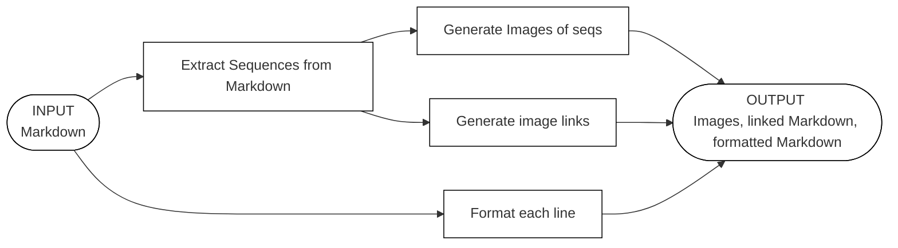

# [mdpicgen](https://github.com/nrichards/mdpicgen)

Helps keep Markdown editing fun.

This tool reads string sequences from Markdown and generates custom visuals using custom image layers. Adds images back to Markdown.

* "really cool!" -_a personal friend of the developer_

## Inspiration

To help keep Markdown editing fun for projects needing to add many images which are permutations of a source diagram, this tool will do the heavy lifting.

It is designed for the needs of the Qun mk2 synthesizer project's [README.md](https://github.com/raspy135/Qun-mk2) guide documentation, originally. Adding images to the guide provides helpful visualizations to teach synthesizer control combinations. Users may refer to pictures in order to activate features on the synthesizer, in addition to text. There are many combinations available with the Qun, and many images to generate, consequently.

So updating 60+ structured images and their Markdown links is work worthy of automation.

## Features

### Picture is worth 1,000 words

**Before**:

|              Button               | Description |
|:---------------------------------:|-------------|
| SHIFT + SEQ PLAY + turn dial <br> |             |

**After**, adds images:

|                          Button                          | Description |
|:--------------------------------------------------------:|-------------|
| SHIFT + SEQ PLAY + turn dial <br>  |             |

_**and** can make animated GIFs:_

|                          Button                          | Description        |
|:--------------------------------------------------------:|--------------------|
| SHIFT + SEQ PLAY + turn dial <br>  | The `--gif` option |

### Just the big abilities

* **Extract sequences of names of button controls** directly from tables in Markdown, based upon patterns from a customizable file
* **Generate images for each sequence**, from the layers of a customizable illustration
* **Update the original Markdown**, and add missing or update outdated image links, without imposing auto-reformatting on potentially hand-edited (dense) tables
* **Create a new sequence-only Markdown**, only containing the button sequences and their images

# Usage

## Installation

* `pip install -r requirements.txt`
* Running [examples](#examples) are available.

## Markdown and high-level options

```
usage: mdpicgen [-h] --md-file MD_FILE [--md-out-file MD_OUT_FILE]
                [--md-seqs-out-file MD_SEQS_OUT_FILE]
                [--image-out-dir IMAGE_OUT_DIR]
                [--button-pattern-file BUTTON_PATTERN_FILE]
                [--category-pattern-file CATEGORY_PATTERN_FILE]
                [--image-height IMAGE_HEIGHT] [--gif] [--print-formatted]
                [--print-extract]
                {imageset,psd} ...

Parse Markdown table cells into recognized sequences of strings, "keys". Only
matches keys from table columns all identified by patterns in the button-
pattern-file. Inserts and updates links for image files to output Markdown in
the cells after the keys. Creates a sequence-only Markdown with tables
categorizing the sequences. Generate images using image layers, named based
upon the keys -- see sub-commands for image generation details.

options:
  -h, --help            show this help message and exit
  --md-file MD_FILE     Input filename for the Markdown file.
  --md-out-file MD_OUT_FILE
                        Output filename for Input Markdown with updated image
                        links.
  --md-seqs-out-file MD_SEQS_OUT_FILE
                        Output filename for sequence-only Markdown, with
                        categorized tables of button sequences and image
                        links.
  --image-out-dir IMAGE_OUT_DIR
                        Output directory name for composited images, will be
                        created (Default: 'out').
  --button-pattern-file BUTTON_PATTERN_FILE
                        Pattern filename for matching buttons (Default:
                        'qunmk2.patset').
  --category-pattern-file CATEGORY_PATTERN_FILE
                        Category pattern filename for organizing sequences
                        (Default: 'qunmk2_categories.csv').
  --image-height IMAGE_HEIGHT
                        Pixel height of generated images, used with sub-
                        commands (Default: 48).
  --gif                 Generate GIF from button sequences, sets filename
                        extension (Default: false, use PNG).
  --print-formatted     Print formatted Markdown (from '--md-file') to the
                        console.
  --print-extract       Print sequences to console.

Image generation sub-commands:
  {imageset,psd}        Optional sub-commands for how to generate images: the
                        source of image data.
    imageset            Read image data from a directory of images, supports
                        GIF animation of button sequences.
    psd                 NOT RECOMMENDED: Read image data from PSD file.
                        depends on Adobe(tm) Photoshop tech, slow,
                        incompatibilities between PSD tools unexpectedly
                        breaks workflows, animation not supported.
```

## imageset sub-command

Can be combined with [Markdown](#markdown-and-high-level-options).

```
usage: mdpicgen imageset [-h] [--imageset-file IMAGESET_FILE]
                         [--imageset-dir IMAGESET_DIR]

options:
  -h, --help            show this help message and exit
  --imageset-file IMAGESET_FILE
                        Specifies what image filename will be used for what
                        layer, and their xy coordinates.(Default:
                        'qunmk2_imageset.csv')
  --imageset-dir IMAGESET_DIR
                        Directory containing images used as layers defined in
                        '--imageset-file' (Default: 'imageset').
```

## psd sub-command

Can be combined with [Markdown](#markdown-and-high-level-options).

```
usage: mdpicgen psd [-h] --psd-file PSD_FILE

options:
  -h, --help           show this help message and exit
  --psd-file PSD_FILE  Input filename for the PSD file.
```

# Details for getting the most out


_See a [larger diagram of how the data flows](README_FLOW.md), from inputs to outputs._

## Workflow

1. Add a table with [customizable](#button-pattern-file-identifies-images) `"Button"` header text as the first column of a Markdown source document, if not already present.
2. Add button command sequence text, matching the [format of the pattern file](#button-pattern-file-identifies-images) in use, to a cell in that table's `"Button"` column, e.g "`SHIFT + B1`".
3. Add a `<br>` tag at end of that text, inside the first cell, to mark this button sequence for processing. Repeat as desired.
4. Run the tool to generate a [new Markdown file](#add-and-update-image-links-and-a-new-markdown-file) and [images](#generate-gif-images-for-a-markdown-file-to-the-default-out-directory).


## Markdown goes in

* Tables **MUST** have a first column header name of "`Button`" ([customizable](#button-pattern-file-identifies-images) in `*.patset` file). Non-matching tables will be ignored.
* Each first-column cell's contents **MUST** be formatted according to the following. Non-matching cells will be ignored. `Button + Sequence + String` `<br>` `` - see an [example](#examples) below.
  * Note that the `<br>` tag is required. 
  * Note also that the _image link is optional_ because it can be added automatically with `--md-out-file` when there is a properly formatted button sequence and `<br>` tag.
* Group names of controls in a **button sequence string**, a formatted sequence. E.g. "SHIFT + B1". The separators between elements in the grouped sequences are customizable in the [patset file](#button-pattern-file-identifies-images).
  * Internally, the **button sequence string** is parsed to individual button names, e.g. "SHIFT" and "B1"
  * The individual button names are used to extract layers. Then a final image is composited from those layers.
* Button names may differ from the names used for the diagram layers. So, a mapping between the user-facing formatted sequence naming and the layers is implemented.

## Images in and out

This script employs **sub-commands** to generate images.

* **imageset**, **psd** - input sub-commands
  * Chooses the source image data: set of images of PNG files, or a single Photoshop PSD file. See the [usage](#imageset-sub-command) section for details.
* Generated images are sized to fit in tables. Use the `--image-height` [parameter](#markdown-and-high-level-options) to customize the height.
* Imagesets can be [most image filetypes](https://pillow.readthedocs.io/en/stable/handbook/image-file-formats.html), and must have their layer information configured in a [CSV](#imageset-csv-input-gives-visual-layout-and-out-filenames).
* PSD layers are used
  * PSD file must have a layer titled, `"BG"`. This will be composited behind all other layers during image generation.
  * PSD file layer names must include short-names. These short-names must be located after a hyphen (-) in the layer name.
    * E.g. the `"s"` in the layer name, `"SHIFT - s"`
    * See also the [image name discussion](#generates-image-names).
  * PSD layers **should** be rasterized, first. They may be vector layers and this may result in empty images being generated. Rasterizing can fix this issue in some cases. Overall, PSD files can be unexpectedly problematic.
    
Output images feature several useful qualities.

* A background layer is presumed. Hence, this script requires an image for a `"BG"` layer, and a declaration of the `"BG"` layer in the image datasource -- the CSV for imageset, or the PSD.
* Animated GIF images can be used in still-documents, and are designed to effectively visually communicate the sequence.
  * A "poster image" shows the completed sequence, shown at the start
  * Flashes any identical button command "off then on again", to indicate the repeated press.
    * E.g. the sequence `"SPLAY + 5 + 5"` will flash `"5"` by inserting a frame only containing the prior `"SPLAY"` image, before inserting the final `"5"` frame.
  * Hold durations at beginning and end to help convey the goal.
    * Customize delays in [constants.py](constants.py).

## Markdown is generated out

* Advice to avoid path conflicts with generated **Image Links** and **Output Images** is to simply run this script twice -- once to generate Markdown and once to generate images. 
  * Be mindful when running this script that the image output path included within the generated Markdown's Image Links by the `--md-out-file` option, e.g. `` as set with `--image-out-dir`, is the same path data used during generation of images with the `imageset` and `psd` sub-commands. This dual-purpose can be at odds with itself.
  * This can be done with a single [complex](#update-new-markdown-file-and-generate-images-for-qun-project-in-a-single-run) run.

## Generates image names

Images are named according to their button sequence, with shortened button names.

* Names are shortened
  * E.g. "SHIFT" becomes "s", "B1" and "B2" become just `"1"` and `"2"`
* Sequence of names are concatenated together, with underscores separating the buttons that aren't the number-buttons
  * E.g. "SHIFT+B1+B2" becomes filename `"s_12.png"`

## Button pattern file identifies images

Button pattern files (`*.patset`) match button sequences, and individual buttons. They define the output image filenames with substrings that map to each individual button in the sequence.

The files are structured similar to CSVs, and use equals (`=`) instead of commas. They are formatted and line-oriented:

| Format                | Description                                                                                                                                                                                                                                                                                                                                                                                                                          |
|-----------------------|--------------------------------------------------------------------------------------------------------------------------------------------------------------------------------------------------------------------------------------------------------------------------------------------------------------------------------------------------------------------------------------------------------------------------------------|
| `^SHIFT$ = s`         | Match a button description with a [pattern](#matching-pattern-is-powerful), and map the button to a substring to be used when naming a generated image for this button.<br><br>**FORMAT**: <br>[RegEx to match buttons] = [Filename substring, or `%digits%` macro] <br><br>E.g. Here, `SHIFT` maps to the `s` in `s_splay_d.png` for the [sample Markdown's](#picture-is-worth-1000-words) sequence `SHIFT + SEQ PLAY + turn dial`. |
| `# this is a comment` | Comment lines with hash-tag (`#`)                                                                                                                                                                                                                                                                                                                                                                                                    |
| `__header__`          | Identify which tables to parse with this unquoted string. Matches against a table's first column's header text contents.                                                                                                                                                                                                                                                                                                             |
| `__separator__`       | Help break-down and split up a long button sequence into individual buttons, with one or more quoted strings. These individual buttons are then matched against the button patterns, above.                                                                                                                                                                                                                                          |

A [default button pattern file](qunmk2.patset) is provided for the Qun mk2 synthesizer.

### Matching pattern is powerful

* Keys and values separated by an equals (=). 
  * Keys are [regular expressions](https://docs.python.org/3/library/re.html). Use https://pythex.org/ to test expressions.
  * Values are short strings used for [image names](#generates-image-names), or the `%digits%` macro. Can embed the macro in a short string, too.

* `%digits%` macro creates a value from digits in a button sequence. It expands ranges of digits, and carries over single digits. Carefully craft the regex to make the most of this macro.
  * E.g. For RULE = `^My Pattern 2-5,8 Here$ = %digits%`, VALUE = `23458`.
  * **TRICKY**: To avoid capturing unwanted digits with the `%digits%` macro, carefully craft the regex. RegEx key match supports a single capture group: the first. Use this to identify the important digits in a match.
    * `(blabla)` is a capturing group pattern, identifying the important part as `blabla`. Only the first of these will be converted to a value.
    * `(?:blabla)` is a [non-capturing](https://docs.python.org/3/library/re.html) (aka "shy") group, avoiding this becoming the first group, making it invisible to `%digits%`. 
    * E.g. setup capture and non-capture groups to only capture `1-8`, not `2`, and to ignore "`Press `", in `Press B[1-8] (2nd pattern)` with pattern `^(?:Press )?([B]?\[[1-8]-[1-8]\])[ a-zA-Z0-9\(\)\-,\[\].]*$`. This ignores the "`Press `" substring, and captures the first bracket-surrounded digits and digit ranges. See [this tricky match on pythex](https://pythex.org/?regex=%5E(%3F%3APress%20)%3F(%5BB%5D%3F%5C%5B%5B1-8%5D-%5B1-8%5D%5C%5D)%5B%20a-zA-Z0-9%5C(%5C)%5C-%2C%5C%5B%5C%5D.%5D*%24&test_string=Press%20B%5B1-8%5D%20(2nd%20pattern)&ignorecase=0&multiline=0&dotall=0&verbose=0).


### Sample patset

```csv
__header__ = Button
__separator__ = "+"
^SHIFT$ = s
^[B]?(utton)?[ ]?\d[ \-a-zA-Z]*( \(Long press\))?$ = %digits%
^(turn)?[ ]?dial[ a-z]*?$ = d
^NO( \(<\))?[ a-z]*$ = n
```

## Imageset CSV input gives visual layout and out filenames

Encode filenames and layer names for all layers matchable in the [button pattern file](#button-pattern-file-identifies-images).

A default [imageset file](qunmk2_imageset.csv) and [directory](imageset) is provided for the Qun mk2 synthesizer.

### Sample 

#### CSV

```csv
image_file,layer_name,x_pos,y_pos,width,height
bg.png,BG,0,0,1856,1236
s.png,s,1572,157
o.png,1,78,631
```

#### In files 
```dir
/imageset
  /bg.png
  /s.png
  /o.png
```

# Examples

## Markdown sample: 

1. Notice the first row's header is `Button`. This matches the default [patset file](qunmk2.patset).
2. Notice the `<br>` tag is used only once
   1. With `--md-out-file`, an image link will be added, if missing.
   2. Or it will be updated, if already in the doc.
3. Notice the "B1", "SHIFT", etc. are configured in the [patset file](qunmk2.patset).

```markdown
|               Button               | Description                         |
|:----------------------------------:|-------------------------------------|
| B1 + B2 <br>  | A button sequence and image         |
|          SHIFT + B3 <br>           | No image. Will injected with image. |
|              SYS + B4              | No br-tag. Won't receive image.     |
```

## At command line -- show program options, verbosely

* `python3 .` -- base command
* `python3 . imageset -h` -- sub-command will need parameters from base command

## Generate GIF images for a Markdown file to the default `out` directory

* `python3 . --md-file test.md --gif imageset`

For this script's `README.md` to output both PNG and GIF to **`doc`**:

* `python3 . --md-file README.md --image-height 56 --image-out-dir doc imageset`
* `python3 . --md-file README.md --gif --image-height 56 --image-out-dir doc imageset`

## Add and update image links, and a new Markdown file

* `python3 . --md-file test.md --md-out-file out_test_md.md`

## Update new Markdown file and generate images for Qun project in a single run

Assumes BASH, changes directory for clarity's sake, assumes [Qun repository](https://github.com/raspy135/Qun-mk2) is cloned to `../Qun-mk2`:

* `MDPICGEN=$(PWD) ; cd ../Qun-mk2 ; python3 $MDPICGEN/. --md-file README.md --md-out-file README-merge_me.md --image-out-dir manual_images/but --image-height 56 --gif imageset --imageset-file $MDPICGEN/qunmk2_imageset.csv --imageset-dir $MDPICGEN/imageset ; cd -`

## Print all found button sequences from a Markdown file

* `python3 . --md-file test.md --print-extract`

## Read a custom button pattern file, and find button sequences in a Markdown file

* `python3 . --md-file test.md --print-extract --button-pattern-file custom.patset`

## Utility to format and print a Markdown file

* `python3 . --md-file test.md --print-formatted`

# Limitations

* Only one `<br>` tag should be present in a cell for a matching table's first-column. With `--md-out-file`, each br-tag will result in a new image added to the Markdown.

# Requirements

* python 3.10+
* psd-tools 1.9
* pillow - image manipulation
* mistletoe 1.3 - Markdown parsing

## Thanks

* Wow Python, such easy, much functionality
* Google + Gemini AI for teaching me moar Python and helping me design the tool. 
  * Details: suggested names for this tool, wrote initial versions of many functions, introduced me to many basic packages + helped me choose 3rd party libraries, gave me sample code for each, suggested high-level project organization
* [Nunomo](https://github.com/raspy135) for encouraging a "find the fun" approach to this project

# Future 

## Column two, three (etc.) image placements 

Currently, column one is the only column for image extraction and placement. Markdown tables can be written with, or without boundary edge markers (|), which complicates parsing.
* **Solution**: Support arbitrary columns by leveraging [mistletoe](#requirements) to first format and normalize Markdown tables in-memory, then I may rely upon a regular table row boundary pattern and make changes, leveraging that and the non-whitespace elements to inject / update image links, preserving the original non-auto-formatted Markdown's look
* **Solution**: custom HTML `<bp> <bpr> <bpc> <bpg>` tags, which could arbitrarily insert a button picture or columns:

```markdown
| Button                                   | Function                                 |
|------------------------------------------|------------------------------------------|
| SHIFT + SEQ PLAY + turn dial             | <bp> <-BP Inserts image before this text |
| SHIFT + SEQ PLAY + turn dial BPR-> <bpr> | Inserts line-break, and then new image   |
| SHIFT + SEQ PLAY + turn dial BPC-> <bpc> | Inserts new column                       |
| SHIFT + SEQ PLAY + turn dial BPG-> <bpg> | Inserts new GIF                          |
```
