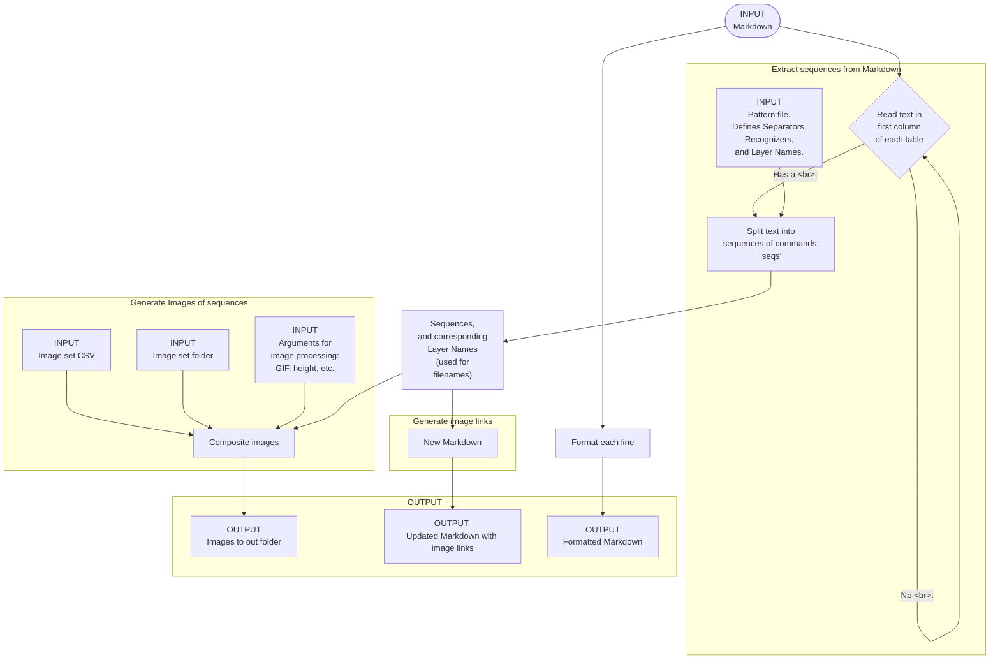

# How it processes

```mermaid
flowchart TD

    A([INPUT \nMarkdown])


    subgraph Extract sequences from Markdown
    B{Read text in \nfirst column \nof each table}
    D[Split text into \nsequences of commands: \n'seqs']
    P[INPUT \nPattern file. \nDefines Separators, \nRecognizers, \nand Layer Names.] 
    end

    A --> B
    B -- Has a #60;br&#62: --> D
    B -- No #60;br&#62: ----> B
    P --> D
    
    M[Sequences, \nand corresponding \nLayer Names \n#40;used for \nfilenames#41;]

    subgraph Generate Images of sequences
    ARGI[INPUT \nArguments for \nimage processing: \nGIF, height, etc.]
    E[Composite images]    
    IS[INPUT \nImage set folder]
    ISV[INPUT \nImage set CSV] 
    ISV --> E
    IS --> E
    ARGI --> E
    end
    D --> M
    E --> OIS

    subgraph Generate image links
    IL[New Markdown]
    end

    M --> E
    M --> IL

    F[Format each line]

    A --> F
    IL --> OM
    F --> OFM

    subgraph OUTPUT
    OIS[OUTPUT \nImages to out folder]
    OM[OUTPUT \nUpdated Markdown with image links]
    OFM[OUTPUT \nFormatted Markdown]
    end
```
